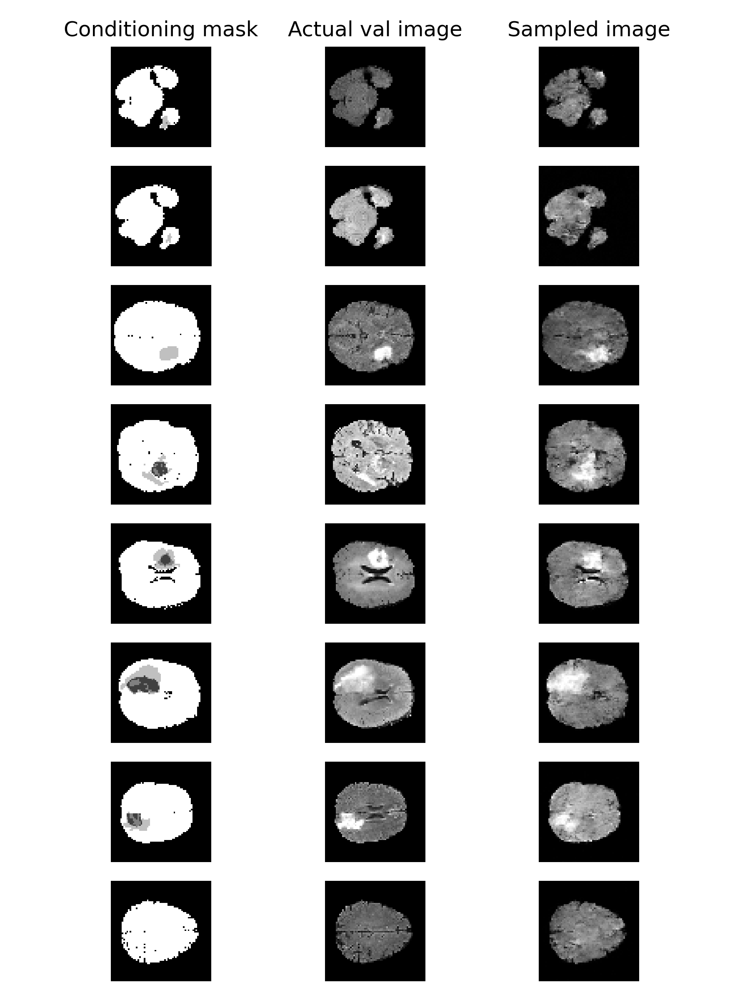

# ControlNet

[]()
[](https://github.com/psf/black)
[](http://mypy-lang.org)
[](https://pycqa.github.io/isort)
[](https://mkdocstrings.github.io)
[](https://github.com/pre-commit/pre-commit)
[](https://mlflow.org)
[](https://dvc.org)
[](https://hydra.cc)
[](https://github.com/PyCQA/bandit)
[](https://github.com/pytest-dev/pytest)
[](https://github.com/commitizen-tools/commitizen)

ControlNet to generate medical images

## Prerequisites

You will need:

- `python` (see `pyproject.toml` for full version)
- `Git`
- `Make`
- a `.secrets` file with the required secrets and credentials
- load environment variables from `.env`

## Installation

Clone this repository (requires git ssh keys)

    git clone --recursive ssh://git@git.fraunhofer.pt/ControlNet/controlnet.git
    cd controlnet

Install dependencies

    conda create -y -n python3.9 python=3.9
    conda activate python3.9

or if environment already exists

    conda env create -f environment.yml
    conda activate python3.9

And then setup all virtualenv using make file recipe

    (controlnet) $ make setup-all

## Dataset

We are currently using [MONAI's](https://docs.monai.io/en/stable/apps.html) implementation of the Medical Segmentation Decathlon challenge (http://medicaldecathlon.com/) to generate items for training, validation or test.

## Run the Code

In order to run the code, you will need to move to the correct directory first:

```bash
cd src/controlnet
```

Then, you will need to train a DDPM model:

```bash
python ddpm_train.py
```

Afterwards, you can train a ControlNet that is able to apply masks to generate more realistic images of brains with and without tumours:

```bash
python cnet_train.py
```
## Results

On the right we can see the images that were generated by the ControlNet that we trained based on the masks on the left column.



## Sources

This code is based on the tutorials provided in the repository [GenerativeModels](https://github.com/Project-MONAI/GenerativeModels/tree/main).

## Documentation

Full documentation is available here: [`docs/`](docs).

## Dev

See the [Developer](docs/DEVELOPER.md) guidelines for more information.

## Contributing

Contributions of any kind are welcome. Please read [CONTRIBUTING.md](docs/CONTRIBUTING.md]) for details and
the process for submitting pull requests to us.

## Changelog

See the [Changelog](CHANGELOG.md) for more information.

## Security

Thank you for improving the security of the project, please see the [Security Policy](docs/SECURITY.md)
for more information.

## License

This project is licensed under the terms of the `No license` license.
See [LICENSE](LICENSE) for more details.

## Citation

If you publish work that uses ControlNet, please cite ControlNet as follows:

```bibtex
@misc{ControlNet controlnet,
  author = {None},
  title = {ControlNet to generate medical images},
  year = {2023},
}
```
